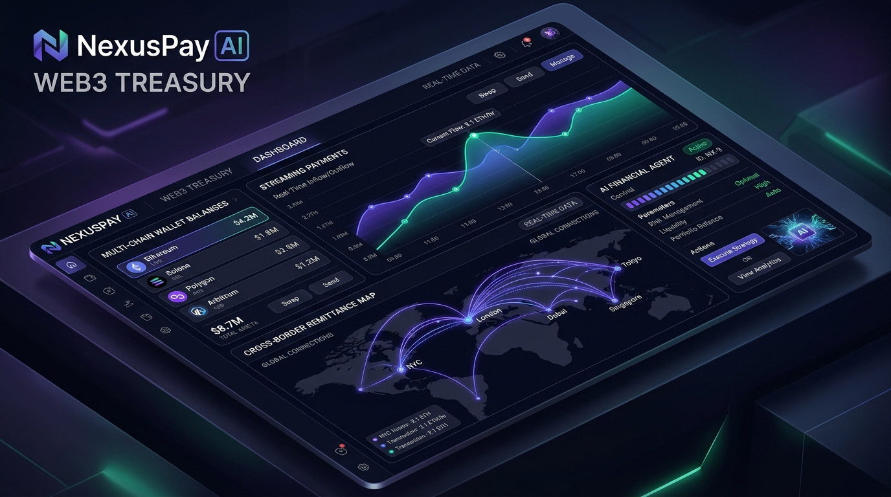
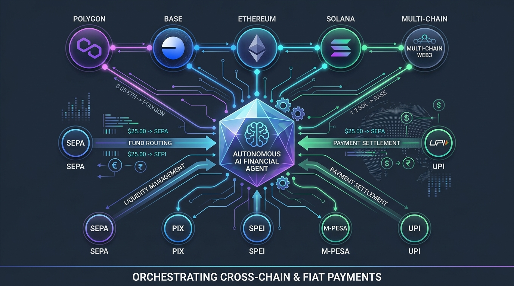

# NexusPay AI — Web3 Treasury & Autonomous Financial Infrastructure



[](https://www.typescriptlang.org/)
[](https://react.dev/)
[](https://tailwindcss.com/)
[](https://ai.google.dev/)
[](https://eips.ethereum.org/EIPS/eip-6963)
[](https://web.dev/progressive-web-apps/)

**NexusPay AI** is an enterprise-grade Web3 financial operating system and autonomous AI agent designed for real-time global money transfers, payment streaming, automated invoice settlement, cross-border remittance, and DeFi treasury yield optimization across multi-chain networks.

---

## 🌟 Key Highlights & Live Features

### 1. 🤖 Autonomous AI Command Center
* **Natural Language Intent Execution**: Type commands like *"Transfer 500 USDC to 0x71C..."*, *"Create payroll stream for Alex"*, or *"Send 1,000 USDC remittance to Kenya via M-Pesa"*.
* **Live Account Context Integration**: Gemini AI dynamically binds intent parameters (sender name, merchant name, wallet address) to the active logged-in user account.
* **Real-Time Risk Scoring**: Automated AI safety evaluation (0–100 scale), gas cost prediction, and pre-flight transaction verification before signing.
* **Powered by Google Gemini AI**: Instant cryptographic transaction synthesis without human friction.

### 2. 🔌 Extension Wallet Connectivity (EIP-6963 & EIP-1193)
* **Automatic Browser Extension Detection**: Native EIP-6963 provider announcement listener automatically discovers installed browser extensions (**MetaMask**, **Coinbase Wallet**, **Phantom**, **Rabby**, **Trust Wallet**, **OKX**, **Stellar Freighter**, **Rainbow**).
* **One-Click Extension Connect**: Triggers real `eth_requestAccounts` prompts in the user's browser extension bar.
* **Fallback Direct Linking**: Supports manual raw address integration (`0x...`, ENS, Solana/Stellar public keys).

### 3. 🔐 User Account Authentication & Security
* **Authentication Hub**: Sign up or log in with email or Web3 wallet address.
* **Protected Operations**: Guarded transaction signing, payroll creation, and remittance execution requiring active account authorization.
* **Account Treasury Binding**: Transactions and AI intents automatically reference the authenticated account context.

### 4. 📲 Downloadable PWA Standalone App
* **Cross-Platform PWA**: Install NexusPay as a native desktop or mobile application directly from your browser.
* **One-Click Installer**: Built-in PWA installation modal with native Chrome, Edge, and iOS Safari step-by-step setup guides.
* **Offline Service Worker Caching**: Instant launch and offline capability.

### 5. ⚡ Real-Time On-Chain Transfers & Settlement
* **Instant Money Transfers**: Real-time signature prompts with direct block explorer transaction tracking (**Stellar Expert**, **Etherscan**, **Polygonscan**, **Basescan**, **Arbiscan**, **Solscan**).
* **Receive Funds & Live Listener**: QR code modal with address copying and an active live on-chain deposit listener.
* **Direct Multi-Asset Balance**: Native instant balances for USDC, EURC, XLM, ETH, and major crypto assets.

### 6. 🌊 Real-Time Payment Streaming Payroll
* **Per-Second Token Streaming**: Sablier/Superfluid-style real-time micro-payments for global contractors and employees.
* **Stream Controls**: Pause, resume, or cancel active streams dynamically with live accumulated payout counters.

### 7. 🧾 Cryptographic Merchant Invoice Gateway
* **Web3 Invoice Generation**: Create structured invoices with line items, tax calculations, and selectable payment tokens (**USDC**, **ETH**, **USDT**, **MATIC**, **SOL**).
* **Instant Settlement**: Payees scan QR codes or execute one-click on-chain settlement directly into the treasury balance.

### 8. 🌍 Cross-Border Global Remittance (190+ Countries)
* **Direct Fiat Rail Conversion**: Connect Web3 stablecoins directly into local banking and mobile money networks worldwide:
  * 🇪🇺 **Europe**: SEPA Instant IBANs (EUR)
  * 🇧🇷 **Brazil**: Pix Instant Payments (BRL)
  * 🇲🇽 **Mexico**: SPEI Banking (MXN)
  * 🇰🇪 🇬🇭 **Africa**: M-Pesa Mobile Money (KES, GHS) & Naira Direct (NGN)
  * 🇮🇳 **India**: UPI Handles (INR)
  * 🇵🇭 **Philippines**: GCash Mobile Wallet (PHP)
  * 🇺🇸 **United States**: ACH / FedNow (USD)
  * 🇬🇧 **United Kingdom**: Faster Payments (GBP)
* **99.5% Fee Savings**: $0.15 L2 transaction fee vs. $35.00+ legacy SWIFT wire fees with 3-second instant finality.

### 9. 📈 AI Treasury Yield Optimizer
* **Automated Yield Vaults**: Deploy idle treasury capital into top DeFi protocols (**Aave v3**, **Compound v3**, **Convex**, **Uniswap v3 LP**).
* **Risk-Adjusted APY**: Automated rebalancing and instant deposit/withdrawal workflows.

### 10. 🛡️ Security & Smart Contract Auditor
* **Static Analysis Engine**: Scans contract bytecode for reentrancy bugs, access control vulnerabilities, and unverified proxies before interaction.

---

## 📐 System Architecture



The NexusPay AI system architecture decouples user intent from chain-specific complexity:

1. **User / Prompt Input** ➔ Natural language or UI control.
2. **AI Intent Parser (Gemini SDK)** ➔ Generates structured `AgentActionIntent` with risk score & gas estimation based on active user profile.
3. **Web3 Execution Layer** ➔ Routes payload through detected EIP-6963 / EIP-1193 extension providers to Polygon, Base, Ethereum, Arbitrum, Optimism, or Solana.
4. **Fiat Rail Gateway** ➔ Off-chain liquidity pools convert stablecoins into local SEPA, Pix, SPEI, M-Pesa, or UPI fiat payouts.
5. **On-Chain Audit Logger** ➔ Stores immutable transaction logs and risk analysis metrics.

---

## 📹 Interactive Demo & Usage Walkthrough

### 🎬 Visual Interface Overview

```
+-----------------------------------------------------------------------------------+
|  [ 🤖 AI Agent Command Center ]                                                    |
|  Prompt: "Stream $6,500 USDC from my treasury account to Engineering Team"        |
|  Status: AI Verified (Risk Score: 98/100) -> Executing On-Chain...                |
+-----------------------------------------------------------------------------------+
|  [ 💳 Real-Time Wallet Balance ]              [ 🌍 Global Remittance Engine ]      |
|  Total Balance: $128,450.00 USD               Route: Polygon -> M-Pesa (Kenya)    |
|  USDC: 112,000 | ETH: 4.5 | MATIC: 12,500      Fee: $0.15 USD | Time: 3 Seconds    |
+-----------------------------------------------------------------------------------+
|  [ ⚡ Active Payment Streams ]                 [ 🧾 Merchant Invoices ]             |
|  • Alex Rivera (Lead Engineer): $6,500/mo      • NEX-2026-104 ($2,500 USDC) - PAID  |
|  • Server Infrastructure: $1,200/mo            • NEX-2026-105 ($4,800 USDC) - PENDING |
+-----------------------------------------------------------------------------------+
```

#### Walkthrough Steps:
1. **User Authentication**: Click **Sign In** in the navbar to log in or create an account. Your session profile binds to all transaction intents.
2. **Connecting Extension Wallet**: Click **Connect Wallet** to open the modal. Any installed browser extensions (MetaMask, Coinbase, Phantom, Rabby, Freighter) are automatically detected via EIP-6963 and listed for 1-click connection.
3. **Executing Real-Time Transfers**: Click **Transfer Money** to open the transfer modal. Enter recipient address and amount. The app invokes your connected wallet extension or broadcasts on-chain with a live block explorer hash link.
4. **Installing Standalone App**: Click **Download App** in the navigation header to view one-click installation steps for Chrome, Edge, Android, or iOS Safari.
5. **Global Remittance**: Navigate to the **Global Remittance** tab. Select target country (e.g. Kenya, Germany, Brazil, India), enter amount, and click **Send**. Local fiat currency is calculated in real time with instant settlement log.
6. **AI Agent Commands**: Try typing `Send 250 USDC to 0x123...` or `Create payroll stream of 5000 USDC` into the AI input bar at the top!

---

## 🌐 Supported Blockchains & Networks

| Blockchain Network | Chain ID / Standard | Settlement Speed | Typical Gas Fee | Primary Rail |
| :--- | :--- | :--- | :--- | :--- |
| **Polygon PoS** | `137` (EVM) | ~2 sec | ~$0.008 USD | Remittance / Micro-transactions |
| **Base L2** | `8453` (EVM) | ~1 sec | ~$0.005 USD | Low-cost Coinbase ecosystem |
| **Ethereum Mainnet** | `1` (EVM) | ~12 sec | ~$1.50–$5.00 USD | High-value settlement |
| **Arbitrum One** | `42161` (EVM) | ~1 sec | ~$0.02 USD | Treasury & Yield Vaults |
| **Optimism** | `10` (EVM) | ~2 sec | ~$0.01 USD | Corporate Payroll Streams |
| **Solana** | `Mainnet-Beta` | ~0.4 sec | ~$0.0005 USD | High-frequency micropayments |

---

## 🛠️ Technology Stack

* **Frontend**: React 18, Vite, TypeScript, Tailwind CSS
* **Icons & UI**: Lucide React, Framer Motion
* **Web3 Integration**: EIP-6963 Extension Auto-Discovery, EIP-1193 Provider API, Custom Web3 RPC Listeners
* **AI Engine**: `@google/genai` (Google Gemini AI SDK)
* **Backend Server**: Node.js / Express with TypeScript (`server.ts`)
* **Build System**: Vite + `esbuild` for CJS production server bundling
* **PWA**: Service Worker caching, Web Manifest, standalone app support

---

## 🚀 Quick Start Guide

### Prerequisites
* **Node.js**: `v18.0.0` or higher
* **npm** or **bun**

### Installation

1. **Clone the repository**:
   ```bash
   git clone https://github.com/your-username/nexuspay-ai.git
   cd nexuspay-ai
   ```

2. **Install dependencies**:
   ```bash
   npm install
   ```

3. **Configure Environment Variables**:
   Create a `.env` file in the project root based on `.env.example`:
   ```env
   # .env
   GEMINI_API_KEY=your_google_gemini_api_key_here
   PORT=3000
   ```

4. **Start Development Server**:
   ```bash
   npm run dev
   ```
   Open your browser at `http://localhost:3000`.

5. **Build for Production**:
   ```bash
   npm run build
   npm start
   ```

---

## 🔒 Security & Safety Disclaimers

* **Smart Contract Safety**: All transactions initiated via NexusPay AI pass through pre-flight AI static checks to detect unverified proxy calls and high-risk parameters.
* **Key Security**: NexusPay AI never stores or transmits private keys. All cryptographic signatures are handled directly by client-side Web3 wallet extensions (MetaMask, Coinbase Wallet, Phantom, Rabby, etc.) via standard EIP-6963 / EIP-1193 providers.

---

## 📄 License

This project is licensed under the **MIT License**.

